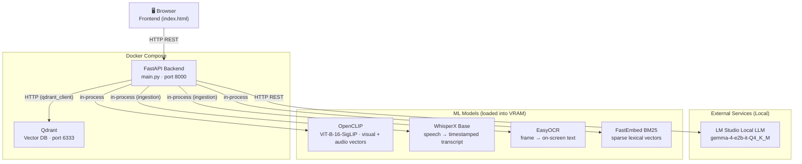
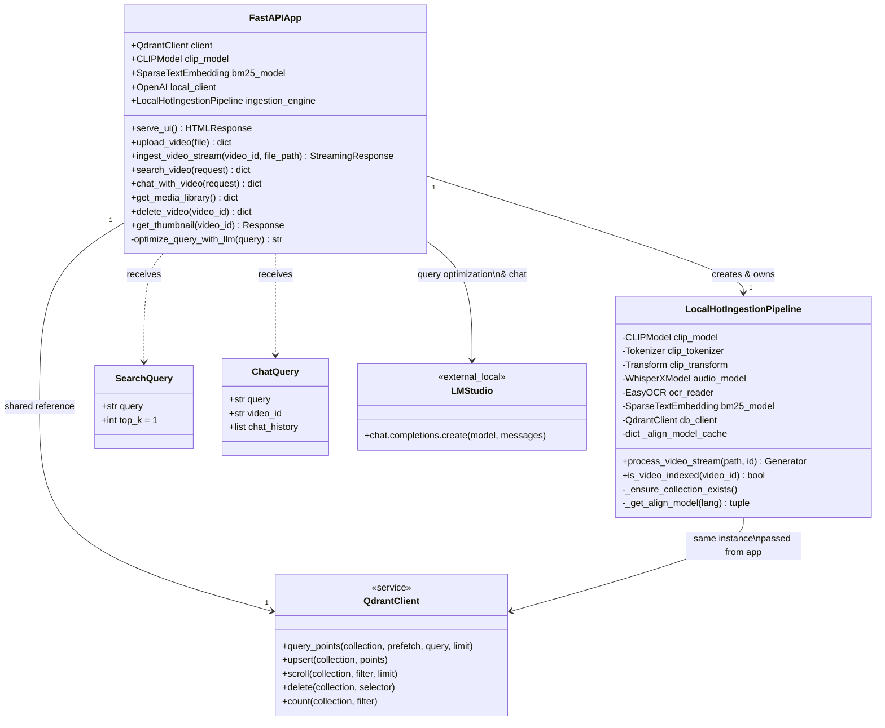
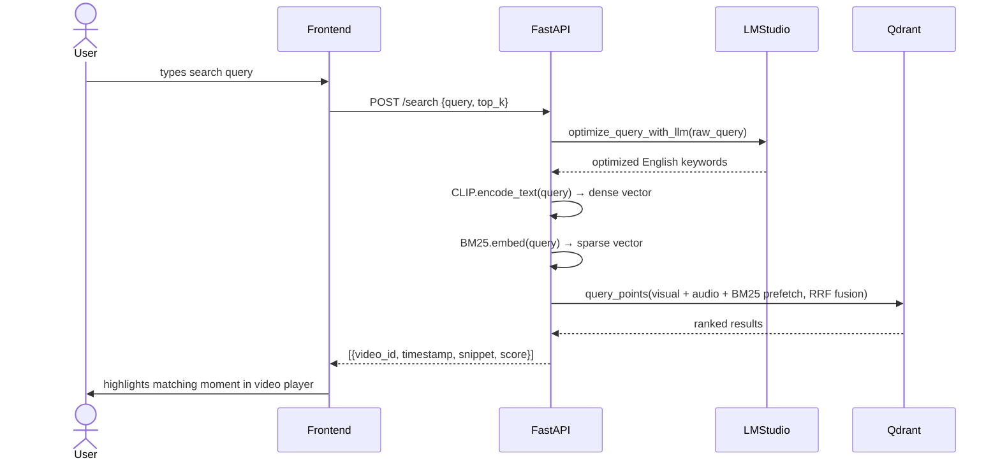
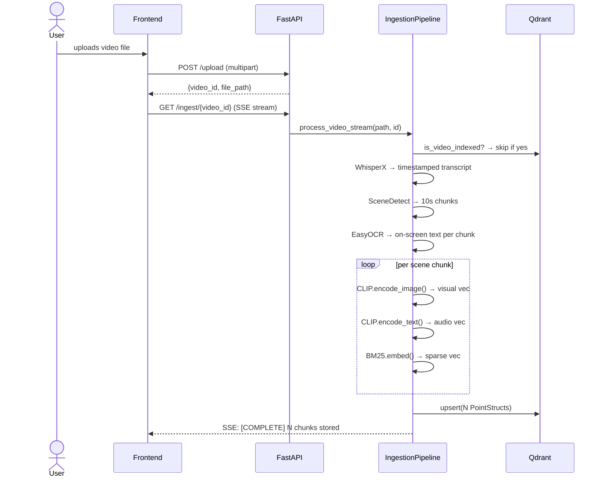

# System UML — Spatio-Temporal Video RAG

## System Architecture

```mermaid
graph TB
    Browser["🖥️ Browser\nFrontend (index.html)"]

    subgraph Docker["Docker Compose"]
        Backend["FastAPI Backend\nmain.py · port 8000"]
        Qdrant["Qdrant\nVector DB · port 6333"]
    end

    subgraph External["External Services (Local)"]
        LMStudio["LM Studio Local LLM\ngemma-4-e2b-it-Q4_K_M"]
    end

    subgraph Models["ML Models (loaded into VRAM)"]
        CLIP["OpenCLIP\nViT-B-16-SigLIP · visual + audio vectors"]
        Whisper["WhisperX Base\nspeech → timestamped transcript"]
        OCR["EasyOCR\nframe → on-screen text"]
        BM25["FastEmbed BM25\nsparse lexical vectors"]
    end

    Browser -- "HTTP REST" --> Backend
    Backend -- "HTTP (qdrant_client)" --> Qdrant
    Backend -- "HTTP REST" --> LMStudio
    Backend -- "in-process" --> CLIP
    Backend -- "in-process" --> BM25
    Backend -- "in-process (ingestion)" --> Whisper
    Backend -- "in-process (ingestion)" --> OCR
```

---

## Class Diagram

```mermaid
classDiagram
    class FastAPIApp {
        +QdrantClient client
        +CLIPModel clip_model
        +SparseTextEmbedding bm25_model
        +OpenAI local_client
        +LocalHotIngestionPipeline ingestion_engine
        +serve_ui() HTMLResponse
        +upload_video(file) dict
        +ingest_video_stream(video_id, file_path) StreamingResponse
        +search_video(request) dict
        +chat_with_video(request) dict
        +get_media_library() dict
        +delete_video(video_id) dict
        +get_thumbnail(video_id) Response
        -optimize_query_with_llm(query) str
    }

    class LocalHotIngestionPipeline {
        -CLIPModel clip_model
        -Tokenizer clip_tokenizer
        -Transform clip_transform
        -WhisperXModel audio_model
        -EasyOCR ocr_reader
        -SparseTextEmbedding bm25_model
        -QdrantClient db_client
        -dict _align_model_cache
        +process_video_stream(path, id) Generator
        +is_video_indexed(video_id) bool
        -_ensure_collection_exists()
        -_get_align_model(lang) tuple
    }

    class SearchQuery {
        +str query
        +int top_k = 1
    }

    class ChatQuery {
        +str query
        +str video_id
        +list chat_history
    }

    class QdrantClient {
        <<service>>
        +query_points(collection, prefetch, query, limit)
        +upsert(collection, points)
        +scroll(collection, filter, limit)
        +delete(collection, selector)
        +count(collection, filter)
    }

    class LMStudio {
        <<external_local>>
        +chat.completions.create(model, messages)
    }

    FastAPIApp "1" --> "1" LocalHotIngestionPipeline : creates & owns
    FastAPIApp "1" --> "1" QdrantClient : shared reference
    FastAPIApp ..> SearchQuery : receives
    FastAPIApp ..> ChatQuery : receives
    FastAPIApp --> LMStudio : query optimization\n& chat
    LocalHotIngestionPipeline --> QdrantClient : same instance\npassed from app
```

---

## Search Request — Sequence Diagram

```mermaid
sequenceDiagram
    actor User
    participant FE as Frontend
    participant API as FastAPI
    participant LMStudio
    participant Qdrant

    User->>FE: types search query
    FE->>API: POST /search {query, top_k}
    API->>LMStudio: optimize_query_with_llm(raw_query)
    LMStudio-->>API: optimized English keywords
    API->>API: CLIP.encode_text(query) → dense vector
    API->>API: BM25.embed(query) → sparse vector
    API->>Qdrant: query_points(visual + audio + BM25 prefetch, RRF fusion)
    Qdrant-->>API: ranked results
    API-->>FE: [{video_id, timestamp, snippet, score}]
    FE->>User: highlights matching moment in video player
```

---

## Ingestion Pipeline — Sequence Diagram

```mermaid
sequenceDiagram
    actor User
    participant FE as Frontend
    participant API as FastAPI
    participant Pipeline as IngestionPipeline
    participant Qdrant

    User->>FE: uploads video file
    FE->>API: POST /upload (multipart)
    API-->>FE: {video_id, file_path}
    FE->>API: GET /ingest/{video_id} (SSE stream)
    API->>Pipeline: process_video_stream(path, id)
    Pipeline->>Qdrant: is_video_indexed? → skip if yes
    Pipeline->>Pipeline: WhisperX → timestamped transcript
    Pipeline->>Pipeline: SceneDetect → 10s chunks
    Pipeline->>Pipeline: EasyOCR → on-screen text per chunk
    loop per scene chunk
        Pipeline->>Pipeline: CLIP.encode_image() → visual vec
        Pipeline->>Pipeline: CLIP.encode_text() → audio vec
        Pipeline->>Pipeline: BM25.embed() → sparse vec
    end
    Pipeline->>Qdrant: upsert(N PointStructs)
    Pipeline-->>FE: SSE: [COMPLETE] N chunks stored
```
